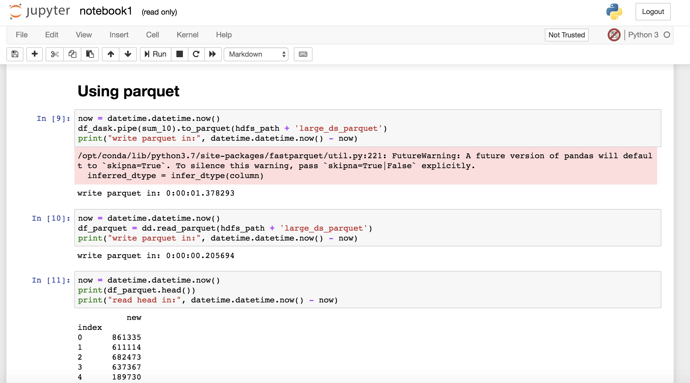
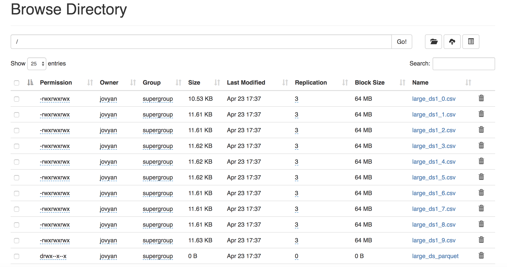
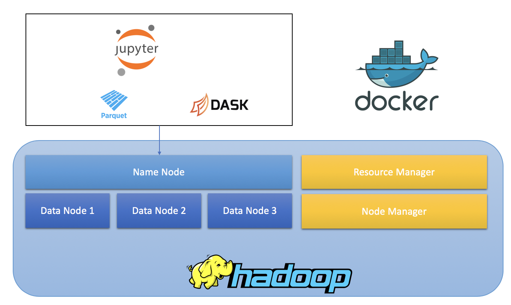

# Testing HDFS with Docker, Dask and Parquet

This system builds
* an hadoop (3.1.1) 3 datanodes cluster, 1 resourcemnagare and 1 nodemanager
* 1 jupyter notebook with Dask and prerequistes installed

## prerequisites

To run the excercise you need 
* Docker
* Docker compose

## Starting

```
docker-compose up | grep jupyter
```
to see only jupyter output. 

Point the browser to:

* connect to http://localhost:8888?token=your token



* connect to http://localhost:9870



## Advanced Options


You can use 

```
docker-compose up
```

to see the output. 


Architecture:



### Node by node
you can also start each single node with


```
docker-compose up -d <<node_name>>
```

eg. 


```
docker-compose up -d namenode
```

```
docker-compose up -d datanode1
```

```
docker-compose up -d jupyter
```

to see logs

```
docker-compose logs -f
```

### cleaning the volumes

to clena the volumes

```
docker volume prune
```

## Building your own jupyer notebook (optional)

To build your jupyter notebook

```
cd docker_jupyter
docker build -t venergiac/jupyter-dask-hdfs .
```

thane start with


```
run -it --rm -p 8888:8888 --network=large_dataset_default venergiac/jupyter_hdfs
```

## Stopping

Please use 

```
docker-compose down
```

to stop containers.
# Credits

* based on bde2020 docker compose https://hub.docker.com/u/bde2020
* explaination of the code available at http://jugsi.blogspot.com/2019/04/working-with-hdfs-parquet-and-dask.html